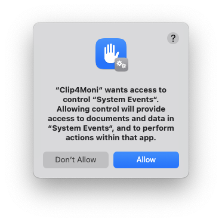

*On macOS, I spotted this dialog. Why is it shown?*

Clip4Moni makes sure that, once you have finished interacting with it, the application that was frontmost before is made frontmost again. Clip4Moni uses AppleScript to achieve this. Take a look at the source code to learn [how this is done](https://github.com/tkuenneth/clip4moni/blob/main/src/jvmMain/java/com/thomaskuenneth/clip4moni/MacHelp.java).